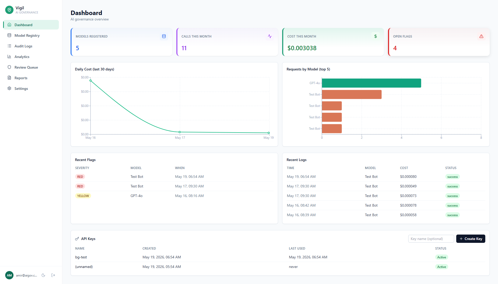
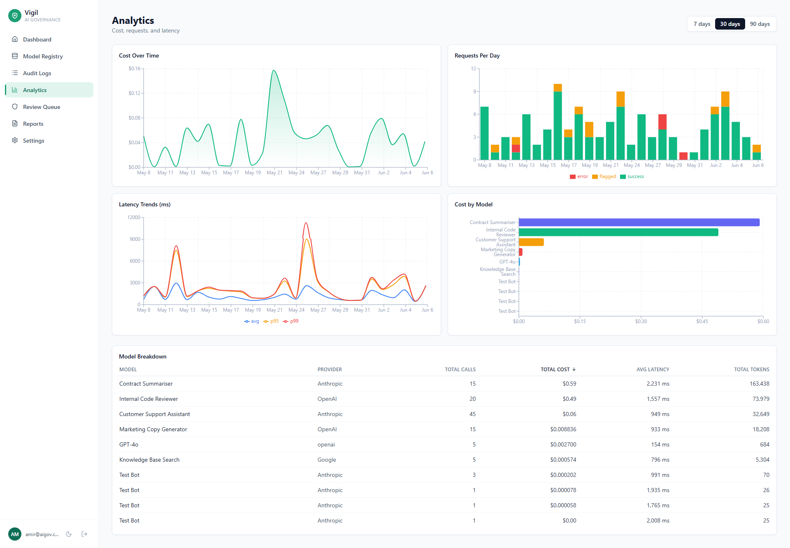

# Vigil — AI Governance Dashboard

> Open-source observability, safety, and cost-tracking for LLM applications. Self-hostable in one `docker compose up`. Built for teams of 2–50 that need NIST AI RMF-aligned governance without paying enterprise prices.



Vigil answers the three questions every team running LLMs in 2026 has to answer:

1. **What models are we running?** — central registry with risk classification and ownership.
2. **Are they behaving correctly?** — every call is logged, every response is scanned for PII / toxicity / prompt injection, every flag goes to a human review queue.
3. **Can we prove compliance if asked?** — one-click PDF reports mapped to the NIST AI RMF functions (Govern / Map / Measure / Manage).

---

## Why this exists

Enterprise AI governance tools (Credo AI, Holistic AI, IBM WatsonX) target $500k+ budgets. There is no credible open-source alternative for a team of five engineers building with the OpenAI and Anthropic APIs. Vigil fills that gap — small enough to run on a single VPS, complete enough to satisfy a NIST AI RMF audit, simple enough to integrate with one line of Python.

---

## Screenshots

### Analytics



Cost over time, requests per day (success / error / flagged stacked), latency trends with p50/p95/p99, and a per-model breakdown — all driven by PostgreSQL aggregations via async SQLAlchemy.

---

## Quick start

```bash
git clone https://github.com/your-org/ai-governance-dashboard.git
cd ai-governance-dashboard
cp .env.example .env

# Generate a strong JWT secret and paste it into .env
openssl rand -hex 32

docker compose up --build
```

When the stack is up:

| Service | URL |
|---|---|
| Dashboard | http://localhost:3000 |
| API + Swagger | http://localhost:8000/docs |
| Postgres | localhost:5432 |
| Redis | localhost:6379 |

Register an account at `/register`, then create an API key from the dashboard and point the SDK at `http://localhost:8000`.

---

## SDK usage

```python
from aigov import AIGovLogger

logger = AIGovLogger(
    api_key="sk_...",                       # one-time key from the dashboard
    model_id="<uuid-of-registered-model>",  # copy from Model Registry
)

response = logger.call(
    provider="anthropic",
    model="claude-haiku-4-5-20251001",
    messages=[{"role": "user", "content": "Hello"}],
    user_id="user_123",
)
```

That's the whole integration. Every call is hashed, cost-scored, safety-checked, and surfaced in the dashboard. The SDK is **fully synchronous**, **never raises on logging failure**, and uses a **2-second timeout** so it cannot slow your host application down.

Want server-side response scanning for PII / prompt-injection? Pass `log_responses=True` when constructing the logger.

---

## Features

### Implemented

- [x] **Model Registry** — central inventory, risk classification (Low / Medium / High / Critical), ownership, archive workflow
- [x] **Audit Logger** — one-line SDK wrap around OpenAI and Anthropic; prompt is hashed by default (privacy-first)
- [x] **Live Cost Tracking** — server-side pricing synced daily from the [LiteLLM catalogue](https://github.com/BerriAI/litellm) (250+ models), no SDK update needed when providers change prices
- [x] **Safety Flagging** — Microsoft Presidio (PII) + OpenAI Moderation API (toxicity) + regex (prompt injection); 3-tier severity (GREEN / YELLOW / RED); runs asynchronously after ingest so it never adds request latency
- [x] **Review Queue** — human-in-the-loop triage with safe / issue-found / escalate outcomes; pulsing RED indicator for live issues
- [x] **Analytics** — cost, requests, latency (p50/p95/p99), per-model breakdowns; period selector for 7 / 30 / 90 days
- [x] **Compliance Reports** — one-click PDF, generated asynchronously with status polling, mapped to NIST AI RMF (Govern / Map / Measure / Manage)
- [x] **Auth** — JWT access + refresh tokens, automatic token refresh in the frontend, rate-limited login and registration (Redis-backed via slowapi), scoped API keys with one-time-display creation, admin-only user role promotion
- [x] **Dark mode** — full theme override, system / light / dark preference, persisted across reloads
- [x] **Async stack** — FastAPI + async SQLAlchemy + asyncpg + APScheduler for the 24h pricing refresh

### On the roadmap

- [ ] Refresh-token rotation + server-side revocation list
- [ ] Salted/HMAC prompt hashes (currently SHA256 of stringified messages)
- [ ] Custom date ranges in analytics (currently 7d / 30d / 90d)
- [ ] CSV export for reports (currently PDF only)
- [ ] Code-split frontend bundle
- [ ] Background-job queue (Redis + RQ) for long-running reports across multiple workers

---

## Tech stack

| Layer | Technology |
|---|---|
| Frontend | React 18 + TypeScript + Vite + Tailwind CSS |
| Charts | Recharts |
| Routing & state | React Router 6, custom Auth/Toast/Theme contexts |
| Backend | FastAPI (async) + SQLAlchemy 2.0 (async ORM) |
| Database | PostgreSQL 15 |
| Cache / queue / scheduler | Redis 7 + APScheduler |
| Rate limiting | slowapi (Redis-backed) |
| PII detection | Microsoft Presidio + spaCy `en_core_web_lg` |
| Toxicity | OpenAI Moderation API |
| PDF reports | WeasyPrint + Jinja2 |
| Migrations | Alembic |
| Containers | Docker + Docker Compose |
| SDK | `aigov` (Python, sync httpx) |

---

## Architecture


```
┌────────────────────────────┐         ┌────────────────────────────────────┐
│  React + Vite (port 3000)  │ ◄────►  │  FastAPI async (port 8000)         │
│                            │  REST   │                                    │
│  /dashboard /models /logs  │  JSON   │  /api/{auth,users,models,keys,     │
│  /analytics /flags /reports│         │       logs,pricing,flags,reports,  │
│  /settings                 │         │       analytics,safety}            │
└────────────────────────────┘         │                                    │
                                       │  background tasks:                 │
┌────────────────────────────┐  X-API  │   • safety check (post-ingest)     │
│  aigov Python SDK          │ ──Key──►│   • report generation (PDF)        │
│  AIGovLogger.call(...)     │         │  APScheduler: 24h pricing sync     │
└────────────────────────────┘         └──────────────┬─────────────────────┘
                                                      │
                                  ┌───────────────────┼───────────────────┐
                                  ▼                                       ▼
                       ┌─────────────────────┐                  ┌──────────────────┐
                       │  PostgreSQL 15      │                  │  Redis 7         │
                       │                     │                  │                  │
                       │  users, api_keys    │                  │  rate limiter    │
                       │  model_registry     │                  │  (slowapi)       │
                       │  audit_logs         │                  │                  │
                       │  safety_flags       │                  └──────────────────┘
                       │  model_pricing      │
                       │  reports            │
                       └─────────────────────┘
```

---

## Repository layout

```
ai-governance-dashboard/
├── backend/
│   ├── app/
│   │   ├── routers/         FastAPI routers (auth, users, models, keys, logs,
│   │   │                    pricing, analytics, flags, reports, safety, cost)
│   │   ├── schemas/         Pydantic request/response models
│   │   ├── auth.py          JWT + bcrypt + dependencies (get_current_user, require_admin)
│   │   ├── limiter.py       slowapi limiter (Redis-backed)
│   │   └── main.py          App factory, lifespan, exception handler, CORS
│   ├── models/              SQLAlchemy ORM
│   ├── services/            cost_calculator, pricing_sync, safety_checker,
│   │                        report_generator, report_queue
│   ├── alembic/             Migrations
│   ├── templates/report.html  WeasyPrint compliance report template
│   └── seeds/               One-off seed scripts
├── frontend/
│   └── src/
│       ├── api/             Typed axios clients (one per resource)
│       ├── components/      Sidebar, Toast, AuthSplit, PrimaryButton, etc.
│       ├── context/         AuthContext
│       ├── hooks/           useTheme, useCountUp, useFadeIn
│       ├── pages/           Dashboard, Registry, Logs, Analytics, Flags,
│       │                    Reports, Settings, Login, Register
│       └── styles/          theme.css (light tokens) + dark.css (overrides)
├── sdk/
│   └── aigov/               Public Python SDK (AIGovLogger)
├── docker-compose.yml
├── .env.example
└── README.md
```

---

## Configuration

Copy `.env.example` to `.env` and fill in the values:

| Variable | Purpose |
|---|---|
| `DATABASE_URL` | Async Postgres DSN. Defaults to the docker-compose Postgres. |
| `REDIS_URL` | Redis URL for rate limiting and APScheduler. |
| `SECRET_KEY` | JWT signing secret. **Required.** Generate with `openssl rand -hex 32`. Boot refuses if left at a known weak value while `DEBUG=false`. |
| `OPENAI_API_KEY` | Optional. Used only for the OpenAI Moderation toxicity check. If unset, that check is skipped silently. |
| `ANTHROPIC_API_KEY` | Optional. Used by the SDK end-to-end test. |
| `FRONTEND_URL` | Origin allowed by CORS. Defaults to `http://localhost:3000`. |
| `DEBUG` | `true` to enable verbose error responses and allow weak `SECRET_KEY` values. |

---

## Local development

### Backend

```bash
docker compose up postgres redis -d
cd backend
pip install -r requirements.txt
python -m spacy download en_core_web_lg   # ~500 MB, one-time
alembic upgrade head
uvicorn app.main:app --reload
```

### Frontend

```bash
cd frontend
npm install
npm run dev
```

### Run the end-to-end SDK test

```bash
export ANTHROPIC_API_KEY=sk-ant-...
python sdk/test_sdk.py
```

The test registers a fresh user, creates a model + API key, makes a real Anthropic call through the SDK, then verifies the log, cost, latency, and (when `log_responses=True`) a `PROMPT_INJECTION` safety flag round-trip.

---

## Security posture

This project takes security seriously even at the MVP stage. Already in place:

- bcrypt password hashing via passlib
- JWT access (24h) + refresh (30d) tokens
- Bearer-token auth with automatic refresh and concurrent-request queueing on the frontend
- Rate limiting on `/auth/login` (10/min) and `/auth/register` (5/min), Redis-backed so it survives reloads and works across replicas
- Admin role is **not** user-controllable — `/auth/register` ignores any `role` field; admins promote others via `PUT /api/users/{id}/role`
- `SECRET_KEY` validator refuses to boot in non-DEBUG mode if left at a known weak value
- Owner-only access on API keys, reports, and download URLs
- `X-API-Key` ingest hashes the raw key (SHA256) before lookup; raw keys are shown to the user exactly once

Known gaps tracked in the roadmap above.

---

## Contributing

Issues and pull requests welcome. Run `pytest` (backend) and `npm run build` (frontend) before opening a PR. New routes should ship with at least one happy-path test.

---

## License

MIT — see [LICENSE](LICENSE).

---

*Vigil is the open-source reference implementation of governance-as-code for LLM applications. If you're using it in production, I'd love to hear about it.*