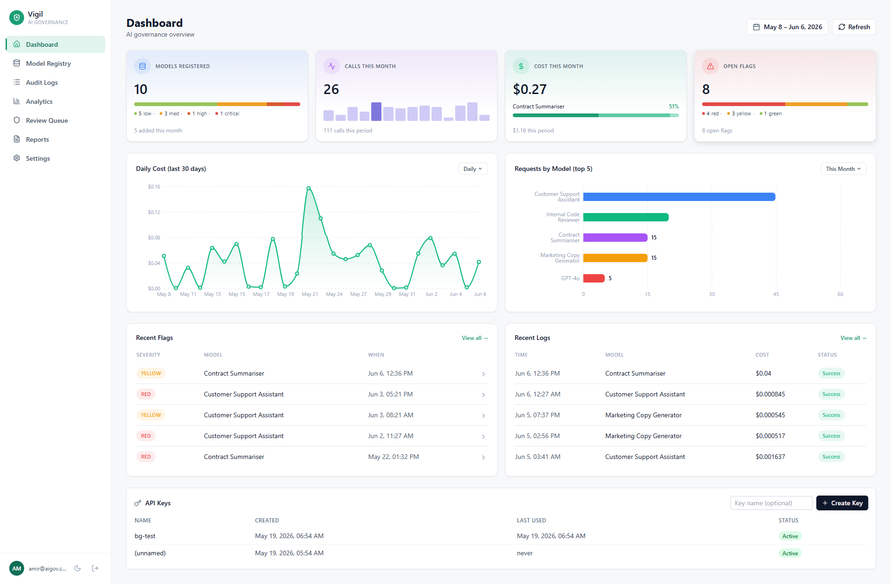
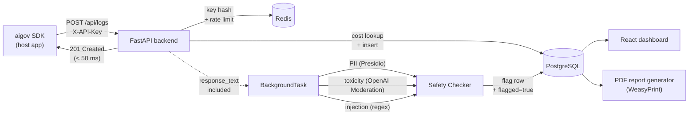

# Vigil

NIST-aligned AI governance for teams running LLMs in production. Self-hostable in one command.

[](https://github.com/amiraijaz/ai-governance-dashboard/actions/workflows/ci.yml)
[](./backend/coverage.svg)
[](https://pypi.org/project/aigov)
[](./LICENSE)
[](./docker-compose.yml)
[](https://www.nist.gov/itl/ai-risk-management-framework)

**[▶ Try the live demo](https://vigil-amir.vercel.app)** · `test@vigil.com` / `demo1234`



---

## Problem

Teams shipping LLM features to production have no observability, no safety scanning, and no audit trail. When the compliance question lands ("which models are we running, what do they cost, can you prove nothing leaked"), the answer is a Slack thread and a spreadsheet.

The tools built to answer those questions (Credo AI, Holistic AI, IBM watsonx.governance) target $500K+ procurement cycles. Teams of two to fifty engineers shipping with the OpenAI and Anthropic APIs have nothing built for them. The closest neighbours, Langfuse and Helicone, are excellent at LLM tracing but treat governance as a feature flag rather than the product.

## Solution

Vigil is a governance-first observability layer for LLM apps. One `docker compose up` gives you a central model registry with NIST risk classification, server-side cost and latency tracking against a live pricing catalog of 249 models, automatic PII / toxicity / prompt-injection scanning on every response, a human review queue for flagged calls, and one-click PDF reports mapped to the four NIST AI RMF functions (Govern, Map, Measure, Manage). The SDK is one line at the call site and never throws on logging failure, so the host application's latency and reliability are unaffected.

## Architecture



The ingest path is intentionally cheap. The SDK sends an audit log, the backend hashes the API key, looks up the model's per-1k token price, writes the row, and returns 201. Anything expensive (PII detection, toxicity scoring, injection pattern matching, PDF rendering) runs in a FastAPI BackgroundTask so the host app never waits on it. When the safety check fires, it persists a `safety_flags` row and flips `audit_logs.flagged = true`, surfacing the result in the review queue on the next page load.

## Key Features

- **Model registry with NIST risk classification.** Every model is registered once with owner, deployment date, use case, and a risk tier (Low / Medium / High / Critical). Risk drives the colour of the model row and the composition of the registered-models card on the dashboard.
- **Audit logging with server-side cost computation across 249 models.** Prices come from the [LiteLLM catalog](https://github.com/BerriAI/litellm), refreshed daily by an APScheduler job. The SDK never sees prices, so a provider price change does not require an SDK upgrade.
- **PII detection via Microsoft Presidio, toxicity via OpenAI Moderation, prompt-injection via pattern matching.** Each check produces a typed flag with a confidence score. Severity tiers (GREEN / YELLOW / RED) drive routing into the review queue.
- **Cost and latency analytics with p50 / p95 / p99 percentiles.** Postgres window functions, not in-memory aggregation, so the dashboard scales with the table.
- **Human review queue with severity triage and sign-off.** Reviewers mark flags as `safe`, `issue_found`, or `escalated`, with notes attached and the reviewer email recorded.
- **NIST AI RMF PDF reports.** One click generates a report mapping audit data into the four RMF functions: Govern, Map, Measure, Manage. Rendered with WeasyPrint, generated asynchronously with status polling.


## How Vigil compares

| | **Vigil** | **Langfuse** | **Helicone** |
|---|---|---|---|
| Primary focus | Governance & compliance | LLM tracing & evaluation | Cost monitoring + LLM proxy |
| Governance framing | NIST AI RMF first | Tracing-first, governance via extensions | Cost-first, governance via integrations |
| Risk-tiered model registry | Built-in | Not core | Not core |
| Compliance PDF reports | One click | DIY via export | DIY via export |
| Safety scanning (PII / toxicity / injection) | Built-in, background | Via integrations | Via integrations |
| Self-hostable | One `docker compose up` | Yes | Yes |
| License | MIT | MIT | Apache 2.0 |
| Pricing | Free OSS only | OSS + paid cloud | OSS + paid cloud |

Langfuse and Helicone are the deeper, more mature tools for LLM tracing and prompt engineering. If you need span-level trace trees, dataset-driven evals, or a hosted LLM proxy, reach for them. Vigil's lane is compliance-first governance for a different buyer: the team that needs a defensible "what are we running, what is it costing us, can we prove nothing leaked" answer before security or legal asks, without enterprise procurement. The two roles compose well; they are not the same product.

## Quickstart

### Use the SDK

```bash
pip install aigov
```

```python
from aigov import AIGovLogger

logger = AIGovLogger(api_key="sk_...", model_id="<uuid-from-registry>")

response = logger.call(
    provider="anthropic",
    model="claude-haiku-4-5",
    messages=[{"role": "user", "content": "Hello"}],
    user_id="user_123",
)
```

The SDK is synchronous, has a 2-second timeout, and never raises on a logging failure. Adding it cannot slow down or break the host application.

### Self-host

```bash
git clone https://github.com/amiraijaz/ai-governance-dashboard.git
cd ai-governance-dashboard
cp .env.example .env

# Generate a strong JWT secret and paste it into .env
openssl rand -hex 32

docker compose up --build
```

Dashboard at `http://localhost:3000`, API and Swagger at `http://localhost:8000/docs`. Register an account at `/register`, mint an API key from Settings, and point the SDK at `http://localhost:8000`.

Or skip the setup and **[poke the live demo](https://vigil-amir.vercel.app)** with the credentials above.


## Tech Stack

| Layer | Technology |
|---|---|
| Backend | FastAPI · async SQLAlchemy 2.0 · asyncpg |
| Database | PostgreSQL 15 |
| Cache, rate limit, scheduler | Redis 7 · slowapi · APScheduler |
| Frontend | React 18 · TypeScript · Vite · Tailwind · Recharts |
| Safety scanning | Microsoft Presidio · OpenAI Moderation · regex patterns |
| Reports | WeasyPrint · Jinja2 |
| SDK | `aigov` (Python, sync httpx) |
| Containers | Docker · Docker Compose |
| Test suite | pytest · pytest-asyncio · pytest-cov |
| Production | Render (backend) · Supabase (Postgres) · Upstash (Redis) · Vercel (frontend) |
| Error tracking | Sentry (optional, off when `SENTRY_DSN` unset) |

## Roadmap

- [ ] `aigov-evals`: LLM evaluation framework that registers eval results against the model registry
- [x] [`governance-bench-v1`](https://huggingface.co/datasets/Vigil-ai/governance-bench-v1): public dataset on HuggingFace for benchmarking safety scanners (200 curated cases across PII, hallucination, and prompt injection)
- [ ] Slack and PagerDuty alerts on RED flags
- [ ] Multi-tenant organisations with workspace isolation
- [ ] Full RBAC beyond the current admin / viewer split
- [ ] OpenTelemetry trace export so Vigil data feeds existing observability stacks

## What I'd do differently

I built the dashboard before the SDK had a single external user. The product is shaped right (registry, ingest, review queue, reports), but the order of operations was wrong. The SDK is the wedge: it lives inside customer code, it requires no UI, and it's the part that needs concrete feedback to evolve. Shipping `pip install aigov` standalone against a small hosted ingest endpoint would have validated demand and shaped the data model before three months of dashboard work. The lesson is to build the integration surface first when the product depends on adoption inside someone else's stack.

The first cut ran the safety checker synchronously in the log ingest request. PII detection alone added 800-2000ms to the hot path depending on response length, and the SDK's 2-second timeout started biting under load. Moving the checks into `BackgroundTask` took the ingest path back under 50ms and changed the model from "blocking guarantee" to "eventual consistency on a few-second horizon", which is the right trade for an audit log. More broadly: the LLM observability space is crowded and well-funded, and trying to also be a tracing tool was a distraction. Vigil's edge is the compliance and governance story for teams that cannot pay enterprise prices, and the README, the SDK ergonomics, and the dashboard composition all needed to reflect that focus rather than compete on a dimension where Langfuse and Helicone are years ahead.

---

MIT licensed. See [LICENSE](./LICENSE). Issues and pull requests welcome at the [repo](https://github.com/amiraijaz/ai-governance-dashboard).
